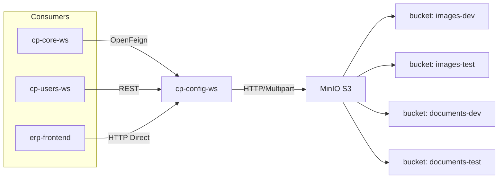
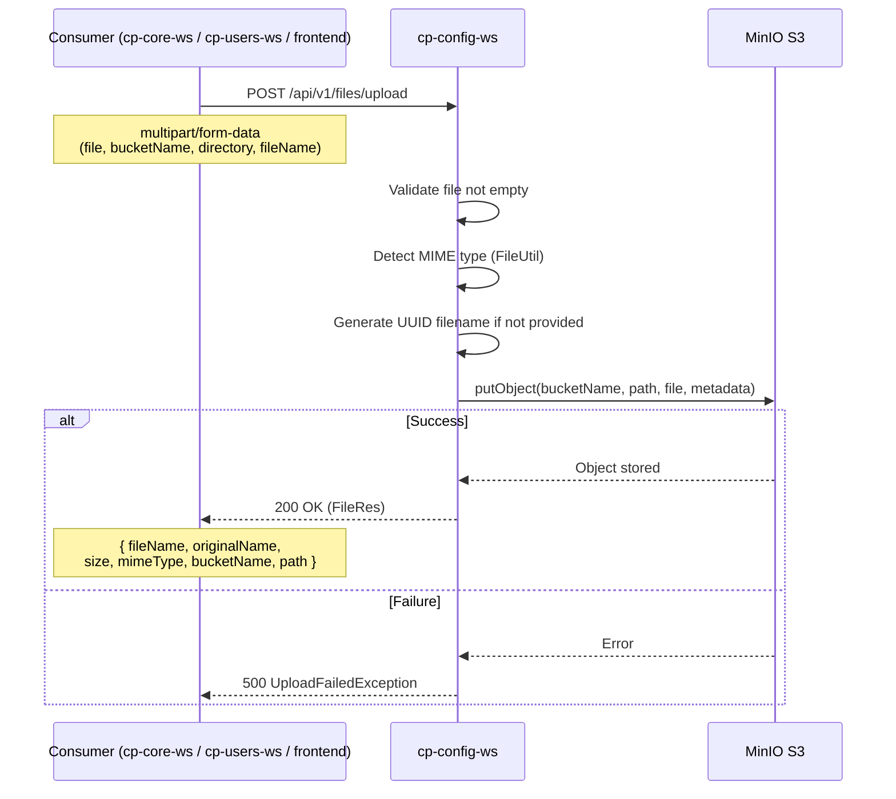
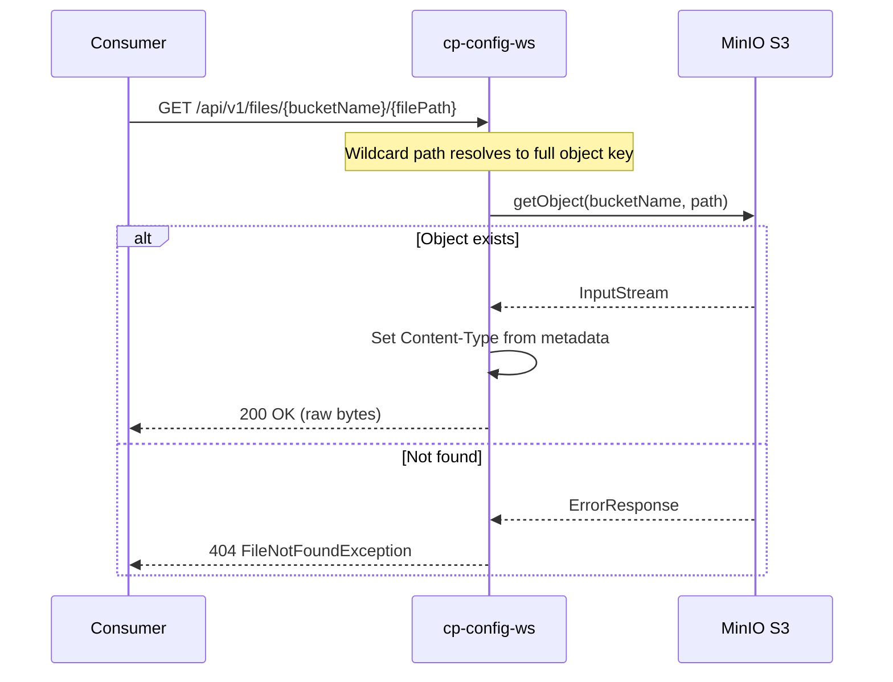
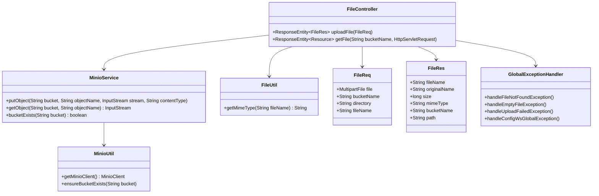

# cp-config-ws -- Configuration & File Storage Microservice


## Overview

`cp-config-ws` is a lightweight, stateless microservice providing centralized file storage and retrieval using **MinIO** (S3-compatible object storage). It acts as the file server for the entire Carton Plast ERP ecosystem, handling uploads and downloads of images, documents, and other binary assets.

**This service has NO database tables, NO JPA, NO entities.** It is purely a RESTful file proxy to MinIO.

## Architecture



- **Storage Backend**: MinIO (self-hosted S3-compatible object storage)
- **Database**: NONE -- completely stateless
- **Port**: 9090 (local), 8080 (Kubernetes)
- **Security**: No Spring Security / Keycloak; access control delegated to Kubernetes network policies

## File Upload Sequence



## File Download Sequence



## API Endpoints

All endpoints are prefixed with `/api/v1/files`.

### Upload File

```
POST /api/v1/files/upload
Content-Type: multipart/form-data

Request params:
  - file: MultipartFile (required)
  - bucketName: String (required) -- MinIO bucket name
  - directory: String (optional) -- subdirectory within bucket
  - fileName: String (optional) -- custom filename; if empty, original filename is used
```

**Response** (200):
```json
{
  "fileName": "uuid-filename.pdf",
  "originalName": "documento.pdf",
  "size": 123456,
  "mimeType": "application/pdf",
  "bucketName": "documents-test",
  "path": "some/directory/uuid-filename.pdf"
}
```

### Download/Get File

```
GET /api/v1/files/{bucketName}/{filePath}
```

- `bucketName`: MinIO bucket name (path variable)
- `filePath`: Full path to the object within the bucket (wildcard path)
- Returns the raw file bytes with the appropriate `Content-Type` header

## Controller

Single controller: `FileController.java` at `.../config/controller/FileController.java`

| Method | Path | Handler | Description |
|--------|------|---------|-------------|
| `POST` | `/api/v1/files/upload` | `uploadFile(FileReq)` | Upload a file to MinIO |
| `GET` | `/api/v1/files/{bucketName}/**` | `getFile(bucketName, request)` | Retrieve a file from MinIO |

## Class Diagram



## Exception Handling

| Exception | When |
|-----------|------|
| `FileNotFoundException` | Requested object does not exist in MinIO |
| `EmptyFileException` | Uploaded file is empty |
| `UploadFailedException` | MinIO put operation fails |
| `ConfigWsGlobalException` | Generic runtime error wrapper |
| `GlobalExceptionHandler` | `@RestControllerAdvice` mapping exceptions to `ErrorRes` |

## Build & Dependencies

**Build**: Gradle 6.8.3, Java 11, fat JAR

**Key dependencies** (`build.gradle`):
- `spring-boot-starter-web` 2.7.0
- `spring-boot-starter-validation`
- `minio` 8.4.1 (MinIO Java SDK)
- `hutool-all` 5.8.1 (utility library -- used for AntPathMatcher)
- `okhttp` 4.9.3 (HTTP client for MinIO SDK)
- `lombok` 1.18.24
- `mapstruct` 1.4.2.Final
- `flyway-core` / `flyway-mysql` (included but NO migrations exist -- no DB)

## Configuration Properties

From `application.properties`:
```properties
minio.endpoint=https://s3.carton-plast.com
minio.access-key=cp-config-ws
minio.secret-key=***
```

## Configuration Profiles

| Profile | Port | Notes |
|---------|------|-------|
| `local` | 9090 | Direct MinIO access, no proxy headers |
| `develop` | 8080 | Tomcat remote IP headers enabled |
| `master` | 8080 | Empty override (inherits base) |

## CI/CD

- **Jenkinsfile**: Kubernetes pod with `dind`, `gradle:6.8.3-jdk11`, `kustomize:v4.1.3`
- **Pipeline stages**: `test` -> `SonarQube` -> `build` -> Docker image build -> push to registry -> ArgoCD deploy (develop only)
- **Dockerfile**: `adoptopenjdk/openjdk11:alpine-jre`, exposes port 8080, runs fat JAR

## Running Locally

```bash
cd erp-config-ws
./gradlew bootRun
# App starts at http://localhost:9090
# Requires MinIO running at minio.endpoint with valid access/secret keys
```

## Integration Points

- **MinIO S3**: Object storage backend
- **cp-core-ws**: Uses `cp.config.ws.url` via OpenFeign to store/retrieve documents
- **cp-users-ws**: Uses `cp.config.ws.url` via REST to store/retrieve user images
- **erp-frontend**: Direct HTTP calls for file download (e.g., user images, document previews)

## Related Services

- **cp-core-ws** -- Primary consumer for document storage (die documents, cyrel documents, etc.)
- **cp-users-ws** -- Consumer for user profile images
- **erp-frontend** -- Direct file download for browser display
