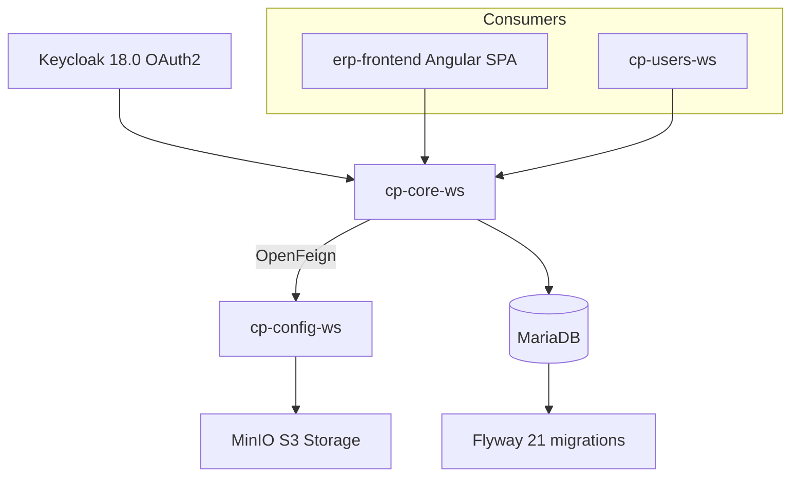
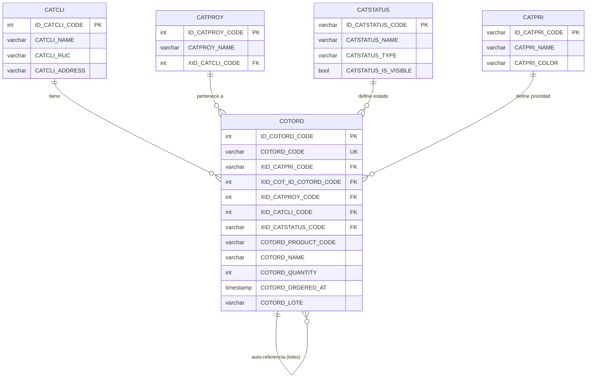
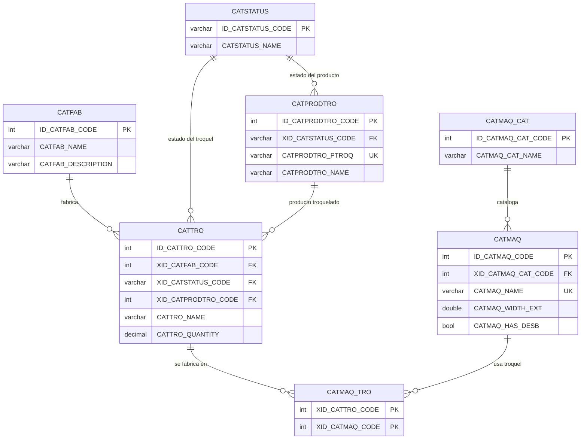
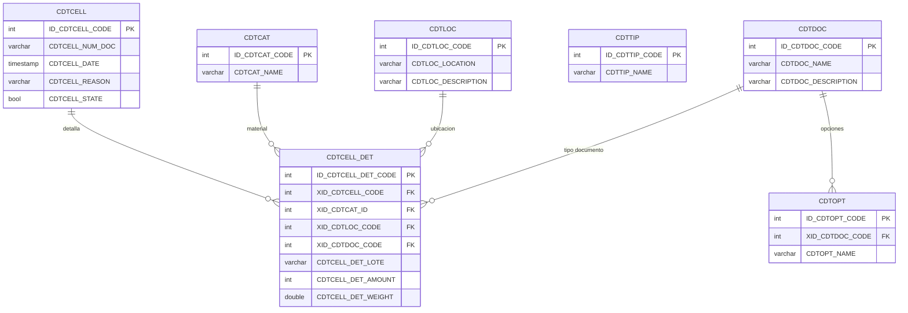
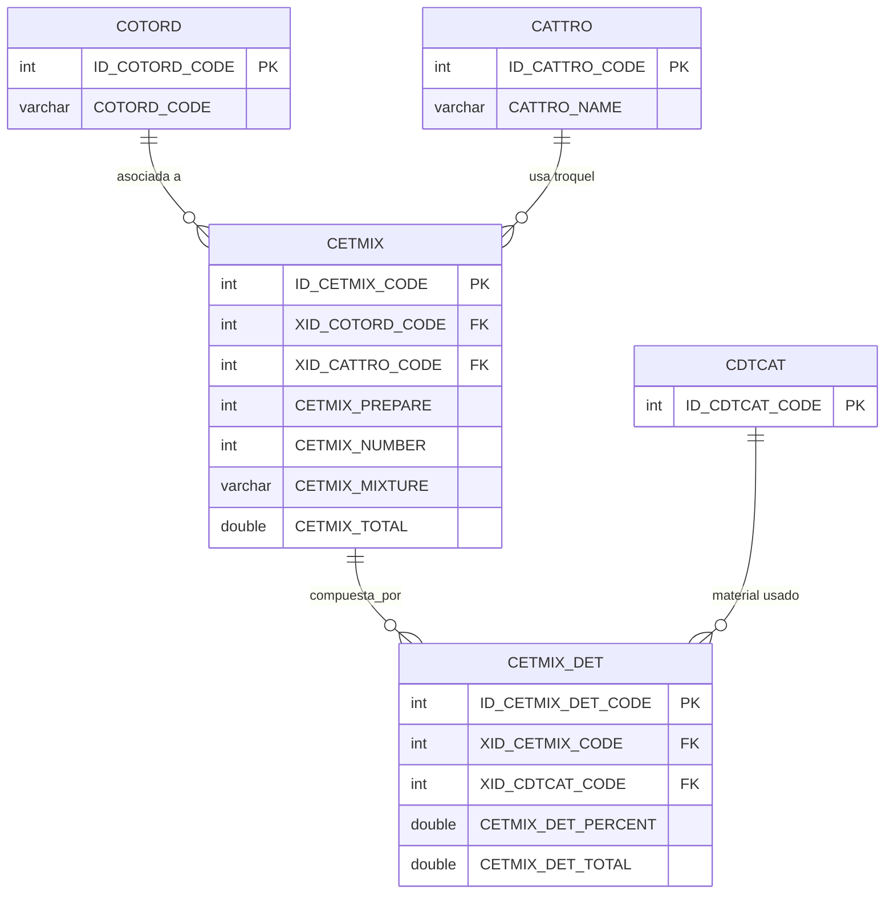
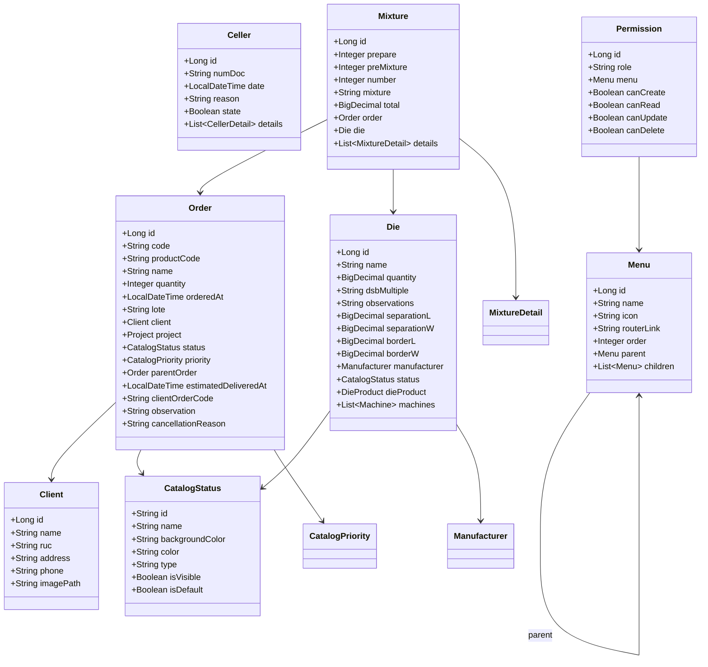
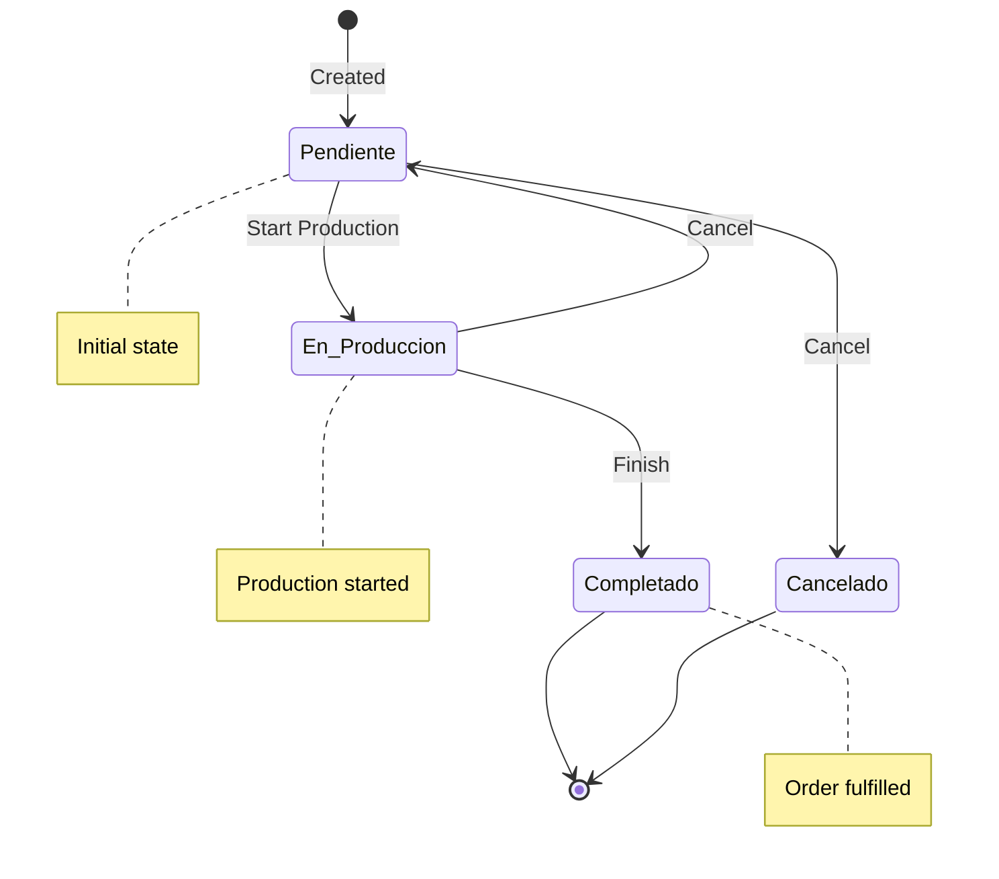
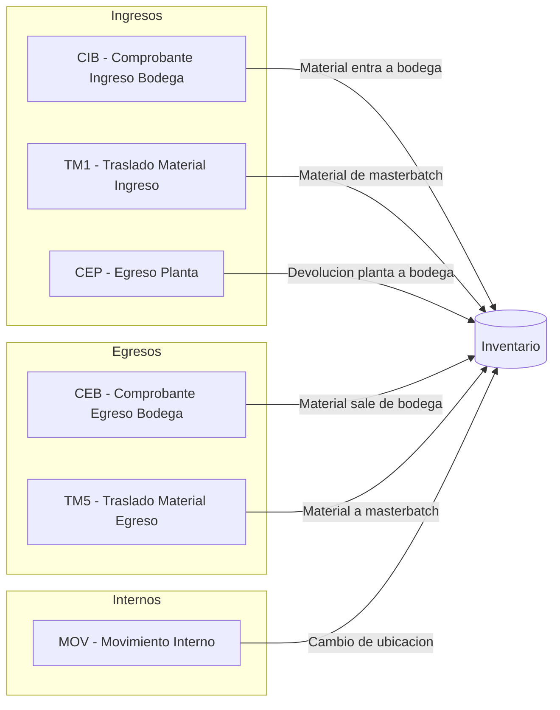
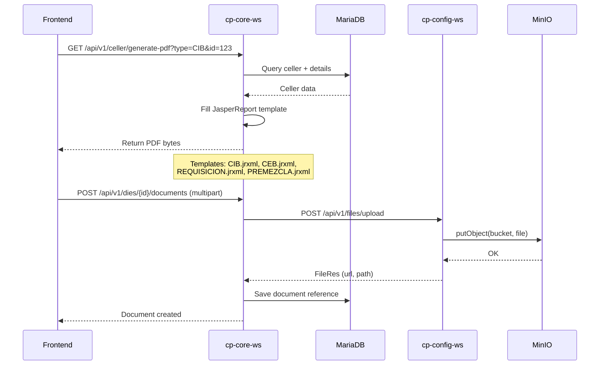

# cp-core-ws -- Core Business Microservice


## Overview

`cp-core-ws` is the primary business-logic microservice in the Carton Plast ERP system. It manages the entire lifecycle of orders, die design and manufacturing, warehouse (celler) operations, client management, mixtures and material requests, menu/permission structures, and catalog maintenance.

This is a **multi-module Gradle project** with three submodules:

| Module | Path | Purpose |
|--------|------|---------|
| `cp-core-ws` (root) | `.` | Spring Boot application, controllers, services, repositories, entities, Flyway migrations |
| `cp-core-vo` | `cp-core-vo/` | Value Objects: request/response DTOs shared across the service |
| `cp-core-common` | `cp-core-common/` | Shared utilities: exception framework, audit base entity, specification builder, HTTP/MinIO helpers |

## Architecture



- **Identity**: Keycloak 18.0 (bearer-only, resource `carton-plast-backend`, realm `carton-plast`)
- **Storage**: Communicates with `cp-config-ws` via OpenFeign for file uploads/downloads (MinIO-backed)
- **Database**: MariaDB with Flyway-managed schema (`cartonplast-dev`, `cartonplast_develop`, `cartonplast_test`)
- **Timezone**: `America/Guayaquil` (set at startup)

## Database Entity-Relationship Diagram

### Orders Domain



### Design Domain (Dies, Machines, Cyrels)



### Warehouse (Celler) Domain



### Mixture Domain



## Domain Entity Class Diagram



## Flow Diagrams

### Order Lifecycle



### Warehouse Document Flow



### PDF Report Generation Flow



## Domain Packages

| Package | Path | Responsibility |
|---------|------|---------------|
| `design` | `.../design/` | Dies, machines, cyrels, printers, homopolymers, colors (A/B/catalog/type/folio), thickness, manufacturer, die products, die documents, cyrel documents |
| `orders` | `.../orders/` | Order CRUD, status transitions (start/cancel), code generation, search |
| `celler` | `.../celler/` | Warehouse: locations, documents, materials, types, celler details, option documents |
| `materialrequest` | `.../materialrequest/` | Material requests (requisiciones) and production turns |
| `mixture` | `.../mixture/` | Mixture formulas and mixture details (premezclas) |
| `client` | `.../client/` | Client management with logo upload |
| `menu` | `.../menu/` | Dynamic menu tree and permission assignment |
| `catalog` | `.../catalog/` | Status and priority catalogs |
| `project` | `.../project/` | Project management (client-linked) |
| `handler` | `.../handler/` | Global REST exception handlers |

## Controllers (31 total)

### design (13)
| Controller | Endpoint | Operations |
|-----------|----------|------------|
| `DieController` | `GET/POST/PUT/DELETE /api/v1/dies` | CRUD dies, search by die product |
| `MachineController` | `/api/v1/machines` | Extrusion machine CRUD |
| `CyrelController` | `/api/v1/cyrels` | Cyrel (printing sleeve) CRUD |
| `PrinterController` | `/api/v1/printers` | Printer CRUD |
| `HomoPolymerController` | `/api/v1/homopolymers` | Homopolymer CRUD |
| `ColorAController` | `/api/v1/colors/a` | Color A CRUD |
| `ColorBController` | `/api/v1/colors/b` | Color B CRUD |
| `ColorCatalogController` | `/api/v1/colors/catalog` | Color catalog CRUD |
| `ColorTypeController` | `/api/v1/colors/types` | Color type CRUD |
| `ThicknessController` | `/api/v1/thickness` | Thickness CRUD |
| `ManufacturerController` | `/api/v1/manufacturers` | Manufacturer CRUD |
| `DieProductController` | `/api/v1/die-products` | Die product CRUD |
| `DieDocumentController` | `/api/v1/dies/{dieId}/documents` | Die document upload/list |
| `CyrelDocumentController` | `/api/v1/cyrels/{cyrelId}/documents` | Cyrel document upload/list |
| `ProjectController` | `GET /api/v1/projects` | List all, search by client, find by code |

### orders (1)
| Controller | Endpoint | Operations |
|-----------|----------|------------|
| `OrderController` | `POST/GET/PUT /api/v1/orders` | CRUD, search, cancel, start, generate code, find by lot/status |

### celler (7)
| Controller | Endpoint | Operations |
|-----------|----------|------------|
| `CellerController` | `/api/v1/celler` | Warehouse document CRUD |
| `CellerDetailController` | `/api/v1/celler/details` | Warehouse line items |
| `LocationController` | `/api/v1/celler/locations` | Warehouse locations CRUD |
| `DocumentController` | `/api/v1/celler/documents` | Document type CRUD |
| `OptionDocumentController` | `/api/v1/celler/option-documents` | Option document CRUD |
| `MaterialController` | `/api/v1/celler/materials` | Material CRUD |
| `TypeMaterialController` | `/api/v1/celler/type-materials` | Material type CRUD |

### materialrequest (2)
| Controller | Endpoint | Operations |
|-----------|----------|------------|
| `MaterialRequestController` | `/api/v1/material-requests` | CRUD material requests |
| `TurnController` | `/api/v1/turns` | CRUD production turns |

### mixture (1)
| Controller | Endpoint | Operations |
|-----------|----------|------------|
| `MixtureController` | `/api/v1/mixtures` | CRUD mixtures and details |

### client (1)
| Controller | Endpoint | Operations |
|-----------|----------|------------|
| `ClientController` | `GET/POST/DELETE /api/v1/clients` | CRUD clients with logo upload |

### menu (2)
| Controller | Endpoint | Operations |
|-----------|----------|------------|
| `MenuController` | `/api/v1/menus` | Dynamic menu tree |
| `PermissionController` | `/api/v1/permissions` | Permission CRUD |

### catalog (2)
| Controller | Endpoint | Operations |
|-----------|----------|------------|
| `CatalogStatusController` | `/api/v1/catalogs/statuses` | Order status catalog |
| `CatalogPriorityController` | `/api/v1/catalogs/priorities` | Order priority catalog |

## Database Migrations (Flyway)

21 incremental migrations under `src/main/resources/db/migration/`. All tables use Spanish/abbreviated naming.

| Migration | Tables Created | Description |
|-----------|---------------|-------------|
| V1.0 | `CATFAB`, `CATTRO`, `CATMAQ` | Manufacturers, dies (troqueles), machines |
| V1.1 | `CATSTATUS` | Order status catalog |
| V1.2 | `CBTMEN` | Menu structure |
| V1.3 | `CATHOM` | Homopolymers |
| V1.4 | `CATCOP`, `CATCOL`, `CATFOL` | Color catalogs (color A, color B, folio) |
| V1.5 | `CATTHI` | Thickness |
| V1.6 | `CATCLI` | Clients |
| V1.7 | `CATIMP` | Printers |
| V1.8 | `CATCIR` | Cyrels (printing sleeves) |
| V1.9 | `CATCTIPPRO`, `CATPRO` | Project types, projects |
| V1.10 | `CBTPER` | Permissions |
| V1.11 | `CATPRI` | Order priorities |
| V1.12 | `COTORD`, `COTORD_DET` | Orders, order details |
| V1.13 | `CDTCAT`, `CDTTIP` | Warehouse catalogs, types |
| V1.14 | `CDTLOC` | Warehouse locations |
| V1.15 | `CDTDOC` | Warehouse documents |
| V1.16 | `CDTOPT` | Warehouse option documents |
| V1.17 | `CATCIRDOC`, `CATTRODOC` | Cyrel documents, die documents |
| V1.18 | `CETMIX`, `CETMIX_DET` | Mixtures, mixture details |
| V1.19 | `CFTTURN` | Production turns |
| V1.20 | `CFTREQ`, `CFTREQ_DET` | Material requests, request details |
| V1.21 | `CATMAQ` (inserts) | Extrusion machine seed data |

## Naming Convention for Tables

- `CAT*` -- Catalogs (manufacturers, dies, machines, statuses, colors, etc.)
- `CBT*` -- Structure/configuration (menus, permissions)
- `COT*` -- Orders (order, order detail)
- `CDT*` -- Warehouse/celler (catalogs, types, locations, documents, options)
- `CET*` -- Production mixtures (mix, mix detail)
- `CFT*` -- Production flow (turns, requests, request details)

## JasperReports

Four report templates in `src/main/resources/receipts/`:

| File | Purpose |
|------|---------|
| `REQUISICION.jrxml` | Material request (requisicion) PDF |
| `PREMEZCLA.jrxml` | Mixture/pre-mix sheet PDF |
| `CIB.jrxml` | Internal warehouse entry (Comprobante de Ingreso a Bodega) PDF |
| `CEB.jrxml` | Internal warehouse exit (Comprobante de Egreso de Bodega) PDF |

## Build & Dependencies

**Build**: Gradle 6.8.3, Java 11, fat JAR via `bootJar`

**Key dependencies** (`build.gradle`):
- `spring-boot-starter-web` 2.6.7
- `spring-boot-starter-data-jpa` 2.6.7
- `spring-boot-starter-security` 2.6.7 (Keycloak adapter)
- `spring-cloud-starter-openfeign` 3.1.1
- `flyway-core` / `flyway-mysql` 8.0.5
- `mariadb-java-client` 3.0.4
- `mapstruct` 1.4.2.Final / `mapstruct-processor` 1.4.2.Final
- `lombok` 1.18.22
- `net.sf.jasperreports:jasperreports` 6.17.0
- `springdoc-openapi-ui` 1.6.4 (OpenAPI/Swagger)
- `org.icepear.echarts:echarts-java` 1.0.1 (chart rendering)

## Configuration Profiles

| Profile | Port | DB Name | Keycloak URL | MinIO Buckets |
|---------|------|---------|--------------|---------------|
| `local` | 8080 | `cartonplast-dev` | `https://auth-test.carton-plast.com` | `images-test`, `documents-test` |
| `develop` | 8080 | `cartonplast_develop` | `https://auth-dev.carton-plast.com` | `images-develop`, `documents-develop` |
| `test` | 8080 | `cartonplast_test` | `https://auth-test.carton-plast.com` | `images-test`, `documents-test` |
| `master` | 8080 | -- | `https://auth-test.carton-plast.com` | -- |

## CI/CD

- **Jenkinsfile**: Kubernetes pod with `dind` (Docker), `gradle:6.8.3-jdk11`, and `kustomize:v4.1.3`
- **Pipeline stages**: `test` -> `SonarQube` -> `build` (`gradle clean build -x test`) -> Docker image build -> push to registry -> ArgoCD deploy (develop/test)
- **Dockerfile**: `openjdk:11.0.15`, exposes port 8080, runs fat JAR `cp-core-ws-1.0.0.jar`

## Running Locally

```bash
cd erp-core-ws
./gradlew bootRun
# App starts at http://localhost:8080
# Active profile: local
```

## Related Services

- **cp-config-ws** -- File storage service (MinIO integration via OpenFeign)
- **cp-users-ws** -- User, person, and preferences management
- **erp-frontend** -- Angular 13 SPA consuming this API
