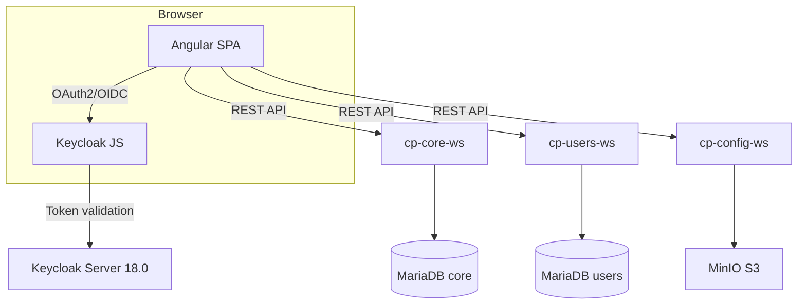
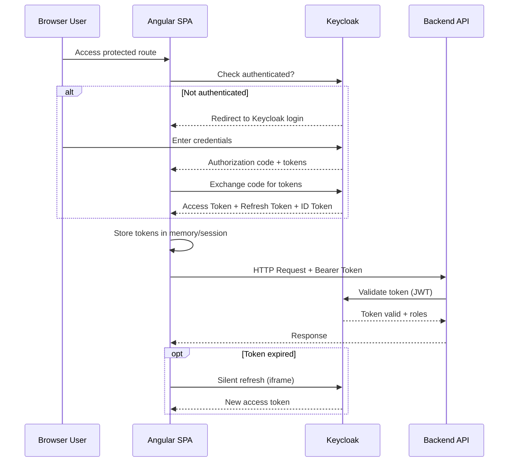
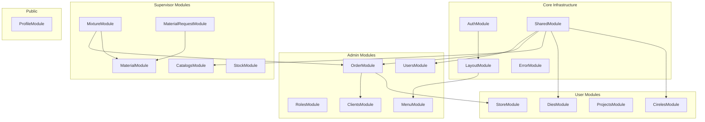
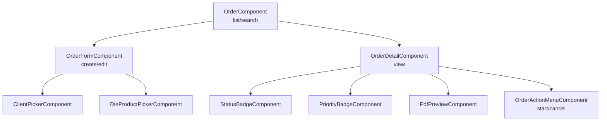

# Carton Plast NG -- Frontend Application


## Overview

`carton-plast-ng` is the Angular 13 single-page application (SPA) serving as the frontend for the Carton Plast ERP system. It provides a responsive, role-based interface for order management, die design, warehouse operations, production control, and administration.

**Version**: 1.1.3 | **Name**: `carton-plast-ng`

## Architecture



## Authentication Flow



## Module Interaction Diagram



## Technology Stack

| Layer | Technology | Version |
|-------|-----------|---------|
| Framework | Angular | 13.2.x |
| UI Components | PrimeNG | 13.1.0 |
| CSS Utilities | PrimeFlex | 3.1.2 |
| Icons | PrimeIcons | 5.0.0 |
| Calendar | FullCalendar | 5.8.0 |
| Charts | Chart.js | 3.3.2 |
| Auth | Keycloak-Angular | 9.1.0 |
| Auth JS | Keycloak-JS | 18.0.0 |
| i18n | ngx-translate | 14.0.0 |
| PDF Viewer | ngx-extended-pdf-viewer | 13.5.1 |
| Spreadsheet | xlsx | 0.18.5 |
| File Save | file-saver | 2.0.5 |
| HTTP | Angular HttpClient + RxJS | 6.6.x |
| Theming | Sass (SCSS) | -- |

## Feature Modules (Lazy-Loaded)

| Module | Route | Min Role | Description |
|--------|-------|----------|-------------|
| `UsersModule` | `/home/usuarios` | ADMIN | User CRUD and management |
| `RolesModule` | `/home/roles` | ADMIN | Keycloak role management |
| `MenuModule` | `/home/menu` | ADMIN | Dynamic menu tree editor |
| `ClientsModule` | `/home/clientes` | ADMIN | Client master data |
| `OrderModule` | `/home/pedidos` | ADMIN | Order lifecycle management |
| `StoreModule` | `/home/bodega` | ADMIN | Warehouse (celler) operations |
| `ProjectsModule` | `/home/proyectos` | ADMIN | Project management |
| `ProfileModule` | `/home/perfil` | USER (any) | User profile and preferences |
| `DiesModule` | `/home/troqueles` | USER | Die/tooling management |
| `CirelesModule` | `/home/cireles` | USER | Cyrel (printing sleeve) management |
| `CatalogsModule` | `/home/catalogs` | SUPERVISOR | System catalogs |
| `MaterialModule` | `/home/material` | SUPERVISOR | Material management |
| `StockModule` | `/home/stock` | SUPERVISOR | Stock/inventory views |
| `MixtureModule` | `/home/mezcla` | SUPERVISOR | Mixture formulas |
| `MaterialRequestModule` | `/home/solicitud` | SUPERVISOR | Material requisitions |

## Component Hierarchy Example (Order Module)



## Core Infrastructure

### `CoreModule`
- Auth module (Keycloak integration)
  - `AuthGuard` -- Route guard checking authentication and roles
  - `RoleEnum` -- Role definitions (ADMIN, USER, SUPERVISOR)
- HTTP interceptors:
  - `LoaderInterceptor` -- Shows loading spinner during HTTP requests
  - `HeadersService` -- Injects auth headers
- Error handling:
  - `GlobalErrorHandler` -- Centralized error handling
  - Error pages: 404 (`Error404Component`), 403 (`Error403Component`), 500 (`Error500Component`)

### `LayoutModule`
- Application shell with sidebar navigation, topbar, and content area
- Dynamic menu rendered from API data

### `SharedModule`
- Reusable PrimeNG components, pipes, directives, and utility classes

## Environment Configuration

| Property | Default (dev) | Dev | Test | Prod |
|----------|---------------|-----|------|------|
| `appApiUrl` | `https://webapp-test-api.carton-plast.com/api/v1` | `https://webapp-dev-api.carton-plast.com/api/v1` | `https://webapp-test-api.carton-plast.com/api/v1` | -- |
| `userApi` | `https://users-test.carton-plast.com/api/v1` | `https://users-dev.carton-plast.com/api/v1` | `https://users-test.carton-plast.com/api/v1` | -- |
| `configApiUrl` | `https://config-api-dev.carton-plast.com/api/v1` | `https://config-api-dev.carton-plast.com/api/v1` | `https://config-api-test.carton-plast.com/api/v1` | -- |
| `imagesBucketName` | `images-test` | `images-dev` | `images-test` | -- |
| Keycloak URL | `https://auth-test.carton-plast.com` | `https://auth-dev.carton-plast.com` | `https://auth-test.carton-plast.com` | -- |
| Keycloak Realm | `carton-plast` | `carton-plast` | `carton-plast` | -- |
| Keycloak ClientId | `carton-plast-frontend` | `carton-plast-frontend` | `carton-plast-frontend` | -- |

## Theming

Custom theme based on PrimeNG's `jungle-green` with three variants:
- **Light** (`theme.light.scss`)
- **Dim** (`theme.dim.scss`)
- **Dark** (`theme.dark.scss`)

Theme files located at `src/assets/theme/jungle-green/`.

## Docker Deployment

```dockerfile
FROM nginx:1.17.7-alpine
COPY nginx.conf /etc/nginx/conf.d/default.conf
COPY ./dist/out /usr/share/nginx/html
EXPOSE 80
```

- **nginx.conf**: SPA fallback (`try_files`), gzip compression, security headers (X-Frame-Options, X-Content-Type-Options, X-XSS-Protection)
- Base image: `nginx:1.17.7-alpine`

## Build & Deployment

```bash
# Install dependencies
npm install

# Development server
npm run start      # ng serve on http://localhost:4200

# Build for environment
npm run build -- --configuration=production
npm run build -- --configuration=test
npm run build -- --configuration=dev

# Run tests
npm run test       # Karma unit tests

# Lint
npm run lint       # TSLint
```

## API Integration

The frontend communicates with three backend services:

| Service | Base URL (env) | Purpose |
|---------|---------------|---------|
| `cp-core-ws` | `appApiUrl` | Orders, dies, cyrels, clients, celler, mixtures, material requests, menus, permissions |
| `cp-users-ws` | `userApi` | Users, persons, preferences, roles, groups, catalogs (gender, ethnic, division) |
| `cp-config-ws` | `configApiUrl` | File upload/download (images, documents) |

## Key Features

- **Role-Based Access Control**: Routes protected by `AuthGuard` with `RoleEnum` checks
- **Internationalization**: Full i18n via `@ngx-translate/core` with Spanish (Latin America) locale
- **Dashboard**: Charts (Chart.js), calendars (FullCalendar), and summary cards
- **PDF Preview**: `ngx-extended-pdf-viewer` for inline PDF viewing
- **Excel Export**: `xlsx` library for spreadsheet generation
- **Dynamic Menu**: Menu structure fetched from `MenuController` API
- **Hash-based Routing**: `HashLocationStrategy` for compatibility with nginx reverse proxy

## Related Services

- **cp-core-ws** -- Primary API for all business operations
- **cp-users-ws** -- User identity and profile API
- **cp-config-ws** -- File storage and retrieval API
