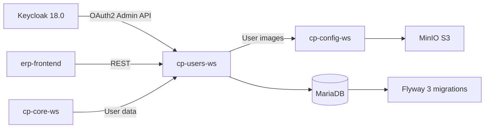
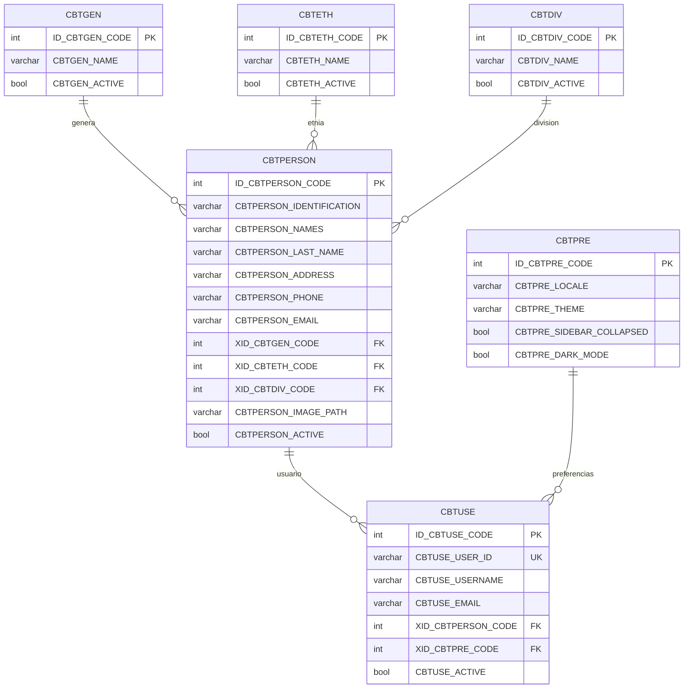
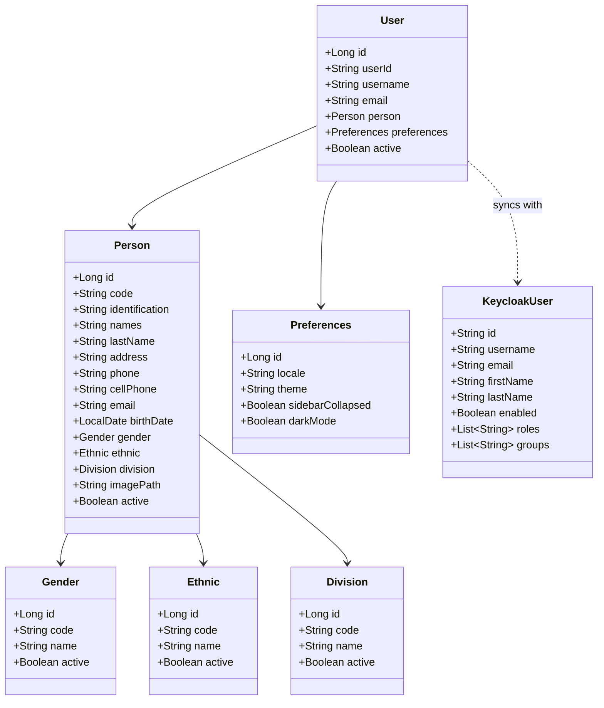
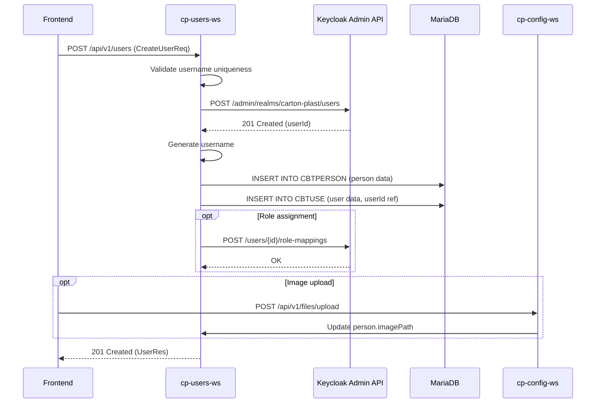

# cp-users-ws -- Users & Identity Microservice


## Overview

`cp-users-ws` is the user and identity management microservice. It acts as a bridge between the ERP system and Keycloak, managing user accounts, person profiles, user preferences, and user images (stored in MinIO via `cp-config-ws`).

**Key responsibilities**:
- User CRUD with Keycloak identity synchronization
- Person profiles (employees, contacts)
- User preferences (locale, theme, dashboard layout)
- User image/avatar management
- Gender, ethnicity, division, and relationship catalogs
- Role and group management (Keycloak-backed)

## Architecture



- **Identity**: Keycloak 18.0 -- both as OAuth2 bearer token validation AND as admin client for user provisioning
- **Port**: 8081 (local), 8080 (environments via Kubernetes)
- **Storage**: User images stored in MinIO via `cp-config-ws` REST API
- **Database**: Dedicated MariaDB database `cartonplast-users-{env}`

## Database Entity-Relationship Diagram



## Entity Class Diagram



## User Creation Flow



## Controllers (11 total)

### User Management
| Controller | Endpoint | Operations | Roles |
|-----------|----------|------------|-------|
| `UserController` | `/api/v1/users` | CRUD users, generate username, find by email, find by username | `backend-admin` |
| `PersonController` | `/api/v1/persons` | List persons, search, profile by username, delete, get image | Authenticated |
| `PreferenceController` | `/api/v1/users/{username}/preferences` | Get/update user preferences | `backend-admin`, `backend-user`, `backend-supervisor` |

### Catalogs
| Controller | Endpoint | Operations |
|-----------|----------|------------|
| `GenderController` | `/api/v1/genders` | Gender CRUD |
| `EthnicController` | `/api/v1/ethnics` | Ethnicity CRUD |
| `DivisionController` | `/api/v1/divisions` | Division CRUD |
| `RelationshipController` | `/api/v1/relationships` | Relationship CRUD |
| `FirstDigitController` | `/api/v1/first-digits` | First digit catalog CRUD |
| `SecondDigitController` | `/api/v1/second-digits` | Second digit catalog CRUD |
| `RoleController` | `/api/v1/roles` | Keycloak role list/sync |
| `GroupController` | `/api/v1/groups` | Keycloak group list |

## Database Migrations (Flyway)

3 migrations under `src/main/resources/db/migration/`.

| Migration | Tables Created | Description |
|-----------|---------------|-------------|
| V1 | `CBTPRE` | User preferences table |
| V2 | `CBTGEN`, `CBTETH`, `CBTDIV`, `CBTPERSON` | Gender, ethnicity, division, person profiles |
| V3 | `CBTUSE` | Users table (FK to CBTPERSON and CBTPRE) |

### Table Details
- **CBTPRE** -- User preferences (locale, theme, sidebar collapsed, etc.)
- **CBTGEN** -- Gender catalog (Masculino, Femenino, etc.)
- **CBTETH** -- Ethnicity catalog
- **CBTDIV** -- Division/Department catalog
- **CBTPERSON** -- Person profiles (names, identification, contact info, image URL)
- **CBTUSE** -- System users (linked to Keycloak ID, references person and preferences)

## Key Entities

| Entity | Table | Fields |
|--------|-------|--------|
| `Person` | `CBTPERSON` | id, code, identification, names, lastName, address, phone, cellPhone, email, birthDate, gender, ethnic, division, imagePath, active |
| `User` | `CBTUSE` | id, userId (Keycloak UUID), username, email, person (FK), preferences (FK), active |
| `Preferences` | `CBTPRE` | id, locale, theme, sidebarCollapsed, darkMode |
| `Gender` | `CBTGEN` | id, code, name, active |
| `Ethnic` | `CBTETH` | id, code, name, active |
| `Division` | `CBTDIV` | id, code, name, active |

## Build & Dependencies

**Build**: Gradle 6.8.3, Java 11, fat JAR

**Key dependencies** (`build.gradle`):
- `spring-boot-starter-web` 2.6.7
- `spring-boot-starter-data-jpa` 2.6.7
- `spring-boot-starter-security` 2.6.7
- `keycloak-admin-client` 18.0.0 (Keycloak admin REST API)
- `keycloak-spring-boot-starter` 18.0.0
- `mariadb-java-client` 3.0.4
- `flyway-core` / `flyway-mysql` 8.0.5
- `mapstruct` 1.4.2.Final
- `lombok` 1.18.22
- `commons-lang3` 3.12.0

## Configuration Profiles

| Profile | Port | DB Name | Keycloak URL | MinIO Bucket |
|---------|------|---------|--------------|--------------|
| `local` | 8081 | `cartonplast-users-dev` | `https://auth-test.carton-plast.com` | `images-test` |
| `develop` | 8080 | `cartonplast_users_develop` | `https://auth-dev.carton-plast.com` | `images-develop` |
| `test` | 8080 | `cartonplast_users_test` | `https://auth-test.carton-plast.com` | `images-test` |
| `master` | 8080 | -- | `https://auth-test.carton-plast.com` | -- |

## CI/CD

- **Jenkinsfile**: Kubernetes pod with `dind`, `gradle:6.8.3-jdk11`, `kustomize:v4.1.3`
- **Pipeline stages**: `test` -> `build` (`gradle clean build -x test`) -> Docker image build -> push to registry -> ArgoCD deploy (develop/test)
- **Note**: No SonarQube stage (unlike core/config)
- **Dockerfile**: `adoptopenjdk/openjdk11:alpine-jre`, exposes port 8080, runs fat JAR

## Running Locally

```bash
cd erp-users-ws
./gradlew bootRun
# App starts at http://localhost:8081
# Active profile: local
```

## Integration Points

- **cp-config-ws** (`cp.config.ws.url`): Upload/download user profile images
- **Keycloak Admin API**: Create/update/delete users, assign roles, manage groups
- **Keycloak OAuth2**: Validates bearer tokens for secured endpoints

## Related Services

- **cp-core-ws** -- Core business logic (uses user data for order assignment, etc.)
- **cp-config-ws** -- File storage for user images
- **erp-frontend** -- Angular SPA consuming user/person/preference APIs
